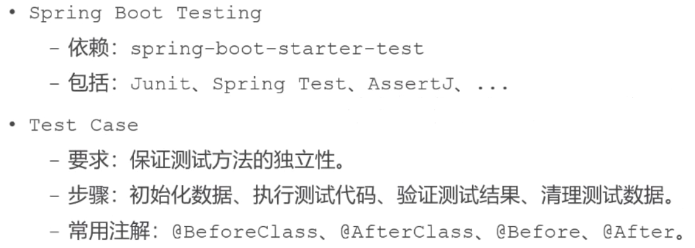
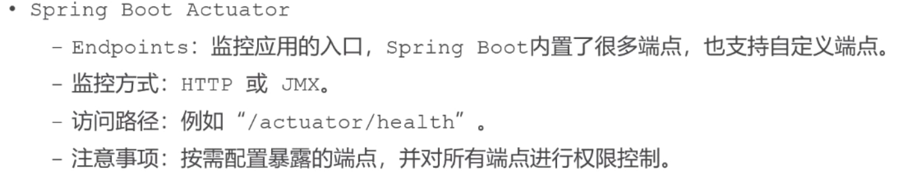

# 8.1 单元测试，项目监控

项目上线前需要做的事情，部署，监控，总结。



Spring boot有这个包可以测试。

 Before就是在调用任何方法之前，它修饰的方法都会被调用一次


验证这几个注解的作用

```java
@RunWith(SpringRunner.class)
@SpringBootTest
@ContextConfiguration(classes = CommunityApplication.class)
public class SpringBootTests {

    @Autowired
    private DiscussPostService discussPostService;

    private DiscussPost data;

    @BeforeClass
    public static void beforeClass() {
        System.out.println("beforeClass");
    }

    @AfterClass
    public static void afterClass() {
        System.out.println("afterClass");
    }

    @Before
    public void before() {
        System.out.println("before");

        // 初始化测试数据
        data = new DiscussPost();
        data.setUserId(111);
        data.setTitle("Test Title");
        data.setContent("Test Content");
        data.setCreateTime(new Date());
        discussPostService.addDiscussPost(data);
    }

    @After
    public void after() {
        System.out.println("after");

        // 删除测试数据
        discussPostService.updateStatus(data.getId(), 2);
    }

    @Test
    public void test1() {
        System.out.println("test1");
    }

    @Test
    public void test2() {
        System.out.println("test2");
    }

    @Test
    public void testFindById() {
        DiscussPost post = discussPostService.findDiscussPostById(data.getId());
        Assert.assertNotNull(post);
        Assert.assertEquals(data.getTitle(), post.getTitle());
        Assert.assertEquals(data.getContent(), post.getContent());
    }

    @Test
    public void testUpdateScore() {
        int rows = discussPostService.updateScore(data.getId(), 2000.00);
        Assert.assertEquals(1, rows);

        DiscussPost post = discussPostService.findDiscussPostById(data.getId());
        Assert.assertEquals(2000.00, post.getScore(), 2);
    }

}
```

# 8.2 项目监控



程序底层做了很多事不清楚。日志cache，