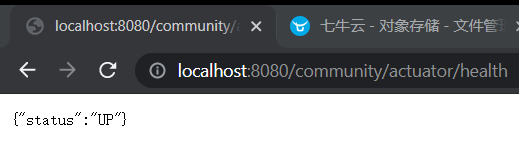

# 8.1 单元测试，项目监控

项目上线前需要做的事情，部署，监控，总结。


Spring boot有这个包可以测试。

 Before就是在调用任何方法之前，它修饰的方法都会被调用一次


验证这几个注解的作用

```java
@RunWith(SpringRunner.class)
@SpringBootTest
@ContextConfiguration(classes = CommunityApplication.class)
public class SpringBootTests {

    @Autowired
    private DiscussPostService discussPostService;

    private DiscussPost data;

    @BeforeClass
    public static void beforeClass() {
        System.out.println("beforeClass");
    }

    @AfterClass
    public static void afterClass() {
        System.out.println("afterClass");
    }

    @Before
    public void before() {
        System.out.println("before");

        // 初始化测试数据
        data = new DiscussPost();
        data.setUserId(111);
        data.setTitle("Test Title");
        data.setContent("Test Content");
        data.setCreateTime(new Date());
        discussPostService.addDiscussPost(data);
    }

    @After
    public void after() {
        System.out.println("after");

        // 删除测试数据
        discussPostService.updateStatus(data.getId(), 2);
    }

    @Test
    public void test1() {
        System.out.println("test1");
    }

    @Test
    public void test2() {
        System.out.println("test2");
    }

    @Test
    public void testFindById() {
        DiscussPost post = discussPostService.findDiscussPostById(data.getId());
        Assert.assertNotNull(post);
        Assert.assertEquals(data.getTitle(), post.getTitle());
        Assert.assertEquals(data.getContent(), post.getContent());
    }

    @Test
    public void testUpdateScore() {
        int rows = discussPostService.updateScore(data.getId(), 2000.00);
        Assert.assertEquals(1, rows);

        DiscussPost post = discussPostService.findDiscussPostById(data.getId());
        Assert.assertEquals(2000.00, post.getScore(), 2);
    }

}
```

# 8.2 项目监控


程序底层做了很多事不清楚。日志cache，

## 导包

只有一个关闭服务器断电是禁用的

```xml
<dependency>
    <groupId>org.springframework.boot</groupId>
    <artifactId>spring-boot-starter-actuator</artifactId>
    <version>2.5.2</version>
</dependency>

```

启动看看暴露的端点，表示状态ok 



http://localhost:8080/community/actuator/info 可以返回服务端一些信息{}


## 配置才能暴露

```xml
# actuator
management.endpoints.web.exposure.include=*
management.endpoints.web.exposure.exclude=info,caches
```

http://localhost:8080/community/actuator/beans

http://localhost:8080/community/actuator/loggers

以上都是内置端点，也可以自定义端点

## 自定义端点Actuator

查看数据库连接

通过连接池访问连接

连接池使用spring 容器管理

http://localhost:8080/community/actuator/database

```json
{"msg":"获取连接成功!","code":0}
```

```java
@Component
@Endpoint(id = "database")
public class DatabaseEndpoint {

    private static final Logger logger = LoggerFactory.getLogger(DatabaseEndpoint.class);

    @Autowired
    private DataSource dataSource;

    @ReadOperation
    public String checkConnection() {
        try (
                Connection conn = dataSource.getConnection();
        ) {
            return CommunityUtil.getJSONString(0, "获取连接成功!");
        } catch (SQLException e) {
            logger.error("获取连接失败:" + e.getMessage());
            return CommunityUtil.getJSONString(1, "获取连接失败!");
        }
    }

}
```

## spring security里配置端点

```java
.antMatchers(
        "/discuss/delete",
        "/data/**",
        "/actuator/**"
)
.hasAnyAuthority(
        AUTHORITY_ADMIN
```

http://localhost:8080/community/actuator/health 只有管理员能访问