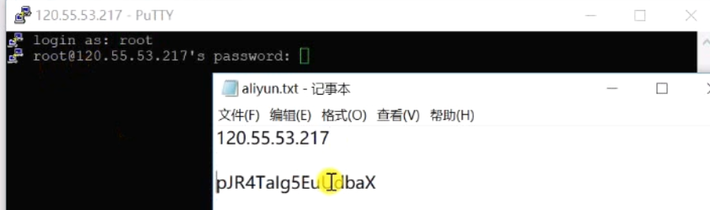
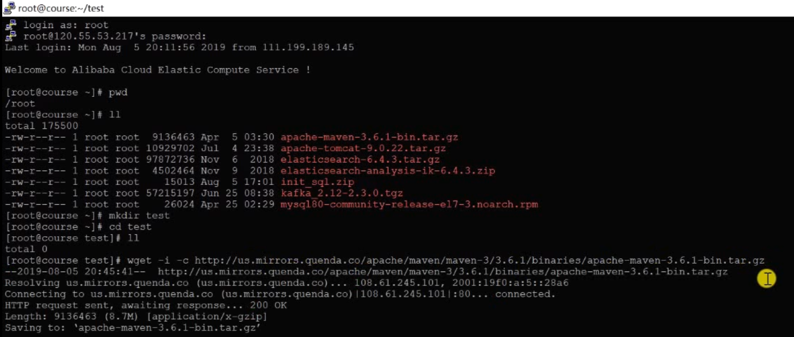
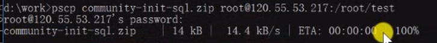
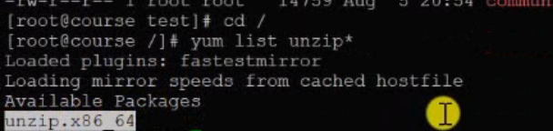
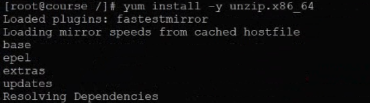
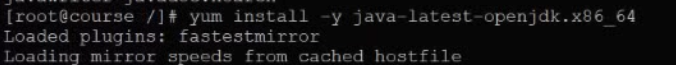

# 8.3 项目部署

Tomcat 

之前用的是Spring boot 内嵌的，现在是正常的

Nginx负责分发请求，浏览器访问的是它，Nginx相当于是Tomcat的代理，称为==反向代理==。反向代理代理的是服务器，==正向代理==代理的是浏览器。将来Nginx可以分发到多个Tomcat节点上。Maven用来编译打包。服务器上打包程序，放到Tomcat，不在本机打包原因，服务器上打包会包含所有依赖的jar会很大，本地打好的包上传耽误时间，还有本地的应用环境和服务器上不一样。Putty用来访问阿里云服务器。 

## 安装

### Putty 

https://putty.org/

yum命令自动配置环境，但是下载的工具版本旧。想要比较新的可以更新yum库文件安装新版本文件。

本地向服务器传文件，先压缩然后cmd, 找到路径，pscp 文件名 root@ip地址：路径下

 

### 安装解压缩工具

## 安装maven

