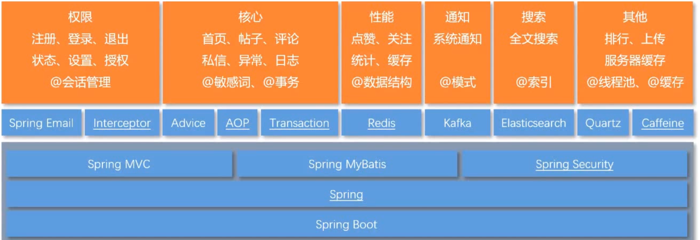

# 8.4 项目总结

Spring Boot可以降低其他技术的难度，所有技术都是spring。 Spring MVC 前后端交互，MyBatis访问数据库，Spring Security管理安全权限了。

Spring Email:

==Interceptor:== 拦截所有请求解决通用问题

会话管理，cookie，session考虑分布部署，数据存到redis里，等等一些细节！！！

Advice:

AOP:

Transaction: 

Redis:

Kafka:

Elasticsearch:

Quartz:

Caffeine: 

