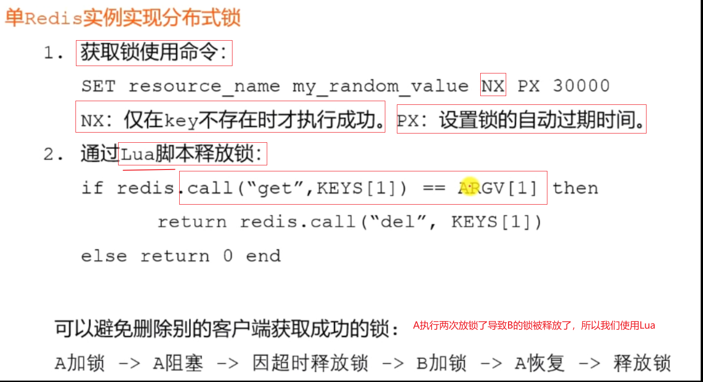
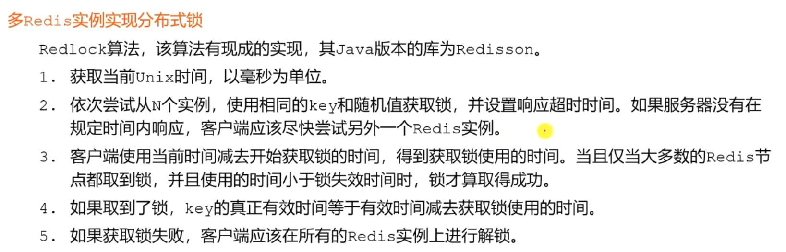
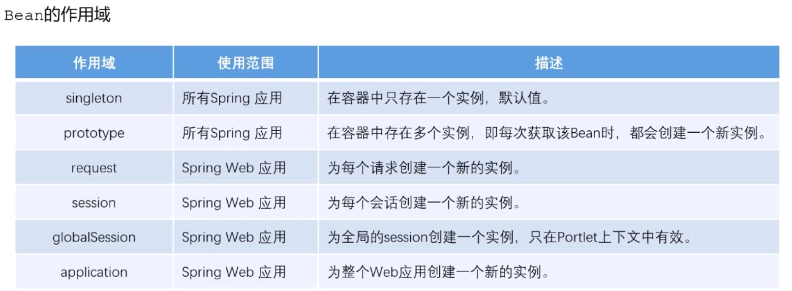

# 8.5 常见面试题

## 1.MySQL
存储引擎、事务、锁、索引

### 存储引擎

我们采用InnoDB, 比较好，它支持transaction事务，支持外键。NDB用来做集群一般不用。

### 隔离性

先加IS然后S, 先加IX然后X。

查询语句默认不加锁

悲观锁是数据库默认的，自己实现锁就是自定义。 实现机制两种。法1比较麻烦，没一张表都要带上。法2CAS, 

索引是为了提高查询的效率： 

## 2.Redis

数据类型、过期策略、淘汰策略、缓存穿透、缓q存击穿、缓存雪崩、分布式锁

### 数据类型

### 过期策略

### 淘汰策略

### LRU算法

### 缓存穿透

缓存失效，导致数据库瘫痪

### 缓存击穿

### 缓存雪崩

### 分布式锁

肯定会问

### 单Redis实例实现分布式锁

### 多Redis实例实现分布式锁

## 3. Spring

Spring IoC、Spring AOP、Spring MVC

### Spring IoC

  Bean的作用域（IoC相关）

  AOP的术语

  Spring MVC（HandlerAdapter里边调了Controller）

————————————————
版权声明：本文为CSDN博主「xiaoshuzi666」的原创文章，遵循CC 4.0 BY-SA版权协议，转载请附上原文出处链接及本声明。
原文链接：https://blog.csdn.net/xiaoshuzi666/article/details/108230430