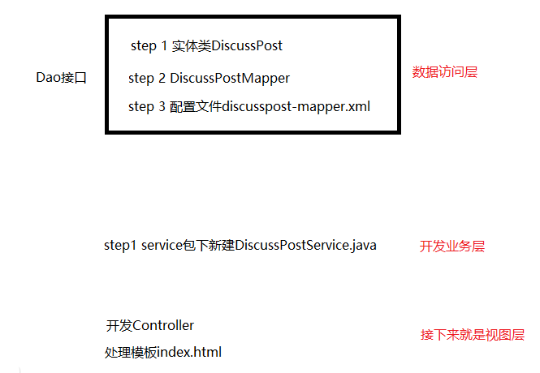

# 8.5 常见面试题

## 1.MySQL
存储引擎、事务、锁、索引

### 存储引擎

我们采用InnoDB, 比较好，它支持transaction事务，支持外键。NDB用来做集群一般不用。

### 隔离性

先加IS然后S, 先加IX然后X。

查询语句默认不加锁

悲观锁是数据库默认的，自己实现锁就是自定义。 实现机制两种。法1比较麻烦，没一张表都要带上。法2CAS, 

索引是为了提高查询的效率： 

## 2.Redis

数据类型、过期策略、淘汰策略、缓存穿透、缓q存击穿、缓存雪崩、分布式锁

### 数据类型

### 过期策略

### 淘汰策略

### LRU算法

### 缓存穿透

缓存失效，导致数据库瘫痪

### 缓存击穿

### 缓存雪崩

### 分布式锁

肯定会问

### 单Redis实例实现分布式锁

### 多Redis实例实现分布式锁

## 3. Spring

Spring IoC、Spring AOP、Spring MVC

### Spring IoC

  ### AOP的术语

 ### Spring MVC

核心组件DispatcherServlet

# 项目笔记

开发顺序： 

服务端的三层结构
`表现层`、`业务层`、`数据访问层`

MVC解决的是表现层的问题：

`-Model`：模型层
`-View`：视图层
`-Controller`：控制层

## 登录与注册

1. 使用 JavaMailSender发送邮件， 使用 Thymeleaf发送 HTML 邮件

UUID 生成随机字符串，激活码需要，上传头像，上传文件，需要给文件生成名字。MD5加密（只能加密不能解密，并且加上salt），对密码加密。

 

登录功能需要会话管理方面的内容

**Cookie**

想要服务器记住浏览器，浏览器在访问服务器的时候，服务器可以创建Cookie对象
是服务器发送到浏览器，并保存在浏览器端的一小块数据。
浏览器下次访问该服务器时，会自动携带块该数据，将其发送给服务器。

`Cookie`工作原理：想要服务器记住==浏览器==，浏览器在访问服务器的时候，服务器可以创建Cookie对象，并将cookie对象在响应的时候发送给浏览器；cookie对象中可以携带数据，==浏览器==得到之后就会==保存到本地==；浏览器下一次访问时候就会在请求头里将这个cookie带回给服务器，服务器就记住了这个用户。
Cookie是特殊的数据，浏览器得到后自动保存，下次请求自动传送。

cookie能够弥补http无状态的情况，使用简单，但是cookie存到客服端==不安全==，容易被盗，所以不存密码。每次发给服务器的时候也会产生流量造成性能上的影响。
于是有了session

**Session**

是JavaEE的标准，用于在服务端记录客户端信息。
数据存放在服务端更加安全，但是也会增加服务端的内存压力。

一般用来存比较**隐私**的数据，而且可以存任何类型大小数据
是服务端对象，但不是http协议的标准。
是`JavaEE`的标准，用于在`服务端`记录客户端信息(`cookie`在`客服端`记录)。
数据存放在**服务端更加安全**，但是也会增加服务端的**内存压力**。
Session本质上依赖于cookie，解决的还是服务器能否记住的问题

服务器创建session对象，**存在服务器端**。浏览器和服务器是多对一的关系。那么浏览器和`session`之间对应关系就通过`cookie`来找！
所以在响应的时候服务器发给浏览器，通过cookie携带，cookie中存了sessionid。浏览器就会存cookie 当它下次访问就会自动发给服务器，服务器得到sessionID之后就会利用sessionId在内存里找，就能找到浏览器相关数据。

能用cookie就用cookie 只有一台服务器的话随便用session，但是现在网站分布式部署session用得少，是因为
**分布式部署**使用`session`存在的问题：
三台服务器，服务器之前会加一个负载均衡的nginx，浏览器访问这个代理，当浏览器发出请求，于是ngix会分发给某服务器。服务器1会创建一个session，返回sessionId，浏览器保存。但是突然发现服务器1比较忙，那就只能发给服务器3，虽然服务器3也能创建session，但是它本地没有这个session，于是只能创建新的session，第二次请求就得不到session中的数据了。问题的解决方案：1 设置负载均衡分配的策略 

- 1种方式叫粘性session，比如浏览器ip 101, 把101分给服务器1，然后每次都是服务器1处理，但是不保证负载均衡
- 2种方式，同步session，当某一个服务器创建session并存数据后，就会同步给别人。每个服务器都存，于是问题：同步影响性能，服务器之间会有耦合。这个对部署比较有影响
- 3方式。共享session，单独一台服务器，把session都放到这台服务器，其他服务器都向这台服务器找session。但是这台服务器可能单体容易挂掉。 搞个集群和之前就一样了
- 4 方案。所有现在能存cookie就cookie不存session。不方便cookie的就存到==数据库==里，数据库可以集群，同步没有问题。但是缺点，传统的关系型数据库存在硬盘里，要从内存读数据并发量大的时候性能就问题。于是我们存到`Redis`里。存到MySQL的数据就会迁移到redis里。

### 验证码 2.17 

导入 jar 包`kaptcha`编写 Kaptcha 配置类， 加载到spring容器里，spring容器对它初始化， session存好验证码。

### 访问登录页面

验证账号、密码、验证码。
成功时，生成**登录凭证**，发放给客户端。（这里用到`cookie`）
**登录凭证:** 生成一个key给客户端让他记住，能够识别你。凭证包括用户的Id, 用户名，密码太敏感，可以存到数据库里面。
在login_ticket.java里。

- 先是实体类login_ticket.java, 然后数据访问逻辑， dao下的接口LoginTicketMapper，之前都是mapper里写，现在也可以用注解实现

- 数据访问开发完了 然后开发业务层， 登录的业务就得接收登录的条件 用户名密码 账号到期时间 在userService里面。

- 然后就是编写**表现层**逻辑， 得写controller，页面请求，方法处理，需要得到表单中的三个值然后提交给userservice处理。 如果userservice里面包含了或者ticket,那就是登录成功返回到首页即可。

**退出：** 将登录凭证修改为失效状态。跳转至网站首页。能够数据库里面看到status变成1 

### **拦截器示例** - 显示登录信息

能够拦截浏览器访问过来的请求，然后请求开始或结束的时候插入代码从而批量解决多个请求==共有的业务==，总之**低耦合**解决通用问题

定义拦截器，实现`HandlerInterceptor`, 配置拦截器，为它指定拦截、排除的路径, 在config下写

### 2.33 账号设置

- 上传头像：
  上传文件，配置文件需要配一下。上线以后换成linux了
  community.path.upload=d:/work/data/upload
  然后服务器三层架构

- 1 数据访问层
  我们是上传文件不是上传到库里，所以没有
- 2 业务层
  主要是上传完了文件后需要更新header url
  上传文件在controller表现层实现，直接存了，不在service层实现。因为MultipartFile 属于spring mvc表现层。业务层更新路径即可。

Spring MVC：通过 `MultipartFile` 处理上传文件

比如没有登录 敲路径就能访问用户设置功能 存在漏洞
所以在服务端需要判断一下。很多功能都需要判断，**拦截器**处理批量请求。
拦截 可以加个注解 需要自己定义， 那么咋识别？

- 在方法前标注自定义注解

- 拦截所有请求，只处理带有该注解的方法

  ----

  

- 自定义检查登录状态

1. 新建一个包annotation, 写一个LoginRequired注解

2. 找需要  @LoginRequired的方法
3. 开发拦截器

4. 然后配置拦截器 指定生效的路径 配置的目的是把静态资源请求排除WebMvcConfig里

5. 重启项目
   访问http://localhost:8080/community/user/setting 强制到了重新登录页面

## 3.1 过滤敏感词

判断字符串里面有没有敏感词，但是网站上可能多且长，不能用JDK自带的功能去替换。实际开发会用前缀树来实现过滤敏感词算法

**名称：** Trie、字典树、查找树

**特点：** 查找效率高，消耗内存大（空间换时间）

**应用：** 字符串检索、词频统计、字符串排序等

一个工具，分为三步

1. 定义前缀树
   首先需要定义好敏感词都有哪些

输入的内容推演，过滤的过程。要想利用这个算法判断字符串里面有没有敏感词需要构建一颗前缀树。

**树的特点：** 

- 前缀树的根节点不包含任何字符，==是空的==，除了根节点以外的每一个节点只包含一个字符

- 从根节点到某一个节点经过的路径上，连接起来就是当前的字符串

- 每个节点的子节点包含的字符串不同，相同的需要合并

必须到叶子节点才能说是敏感词，写代码的时候可以标记==Boolean==值说明敏感词

然后检查需要**三个指针**：

第一个指针默认指向树的根节点

第二个指针默认指向字符串的第一个字符（标记开头），从前往后走不回头，

第三个指针默认指向字符串的第一个字符（标记结尾），小范围往复抖动

不是敏感词的保留，是敏感的就替换。用stringBuilder存放检测结果

然后写个工具把刚才的算法实现

1. 定义前缀树
2. 根据敏感词，初始化前缀树
3. 编写过滤敏感词的方法

需要过一遍代码

## 3.6 发布帖子

异步请求就是网页不刷新还要访问服务器，服务器会返回一些结果，对网页局部刷新。
AJAX：异步通信技术Asynchronous JavaScript and XML
异步的JavaScript与XML，不是一门新技术，只是一个新的术语。

使用AJAX，网页能够将增量更新呈现在页面上，而不需要刷新整个页面。
虽然X代表XML，但目前JSON的使用比XML更加普遍。

## 3.13 事务管理

**事务**是由N步数据库操作序列组成的逻辑执行单元，这系列操作要么**全**执行，要么全放弃执行。
• 事务的特性（ACID）
`原子性（Atomicity`：事务是应用中不可再分的最小执行体。
`一致性（Consistency）`：事务执行的结果，须使数据从一个一致性状态，变为另一个一致性状态。
`隔离性（Isolation）`：各个事务的执行互不干扰，任何事务的内部操作对其他的事务都是隔离的。
`持久性（Durability）`：事务一旦提交，对数据所做的任何改变都要记录到永久存储器中。

- 第一类丢失更新、第二类丢失更新。
- **脏读**、**不可重复读**、**幻读**。
  • 常见的`隔离级别`
  `Read Uncommitted`：读取未提交的数据。
  `Read Committed`：读取已提交的数据。
  `Repeatable Read`：可重复读。
  `Serializable`：串行化。
  加锁，会降低性能

- 第一类丢失更新
  某一个事务的回滚，导致另外一个事务已更新的数据丢失了。

- 第二类丢失更新
  某一个事务的提交，导致另外一个事务已更新的数据丢失了

**脏读**
某一个事务，读取了另外一个事务未提交的数据。

**不可重复读**
某一个事务，对同一个数据前后读取的结果不一致，时间间隔太短

**幻读**
某一个事务，对同一个表前后查询到的**行数**不一致。查询多行数据出现的问题

 事务隔离级别

一般用中间的两个

 **悲观锁（数据库）**

- 共享锁（S锁）
  只能读不能改
  事务A对某数据加了共享锁后，其他事务只能对该数据加共享锁，但不能加排他锁。
- 排他锁（X锁）
  其他事务不能读也不能改
  事务A对某数据加了排他锁后，其他事务对该数据既不能加共享锁，也不能加排他锁。

**乐观锁（自定义）**

默认没有，自己实现

- 版本号、时间戳等（识别变没变，没变就提交数据）
  在更新数据前，检查版本号是否发生变化。若变化则取消本次更新，否则就更新数据（版本号+1）。

---------

## 声明式事务（采用这个）

控制全局

- 通过XML配置，声明某方法的事务特征。
- 通过注解，声明某方法的事务特征。

## 编程式事务

控制局部, 用于业务逻辑复杂，只想管理中间某部分的业务

- 通过 TransactionTemplate 管理事务，
  并通过它执行数据库的操作。

## 3.20 显示评论

**数据层**

1 开发查询功能必须有实体类,根据数据库里的字段 Comment.java

2 开发数据访问组件，mapper, dao下创建interface，CommentMapper

3 comment-mapper.xml

- 根据实体查询一页评论数据。

- 根据实体查询评论的数量。

**业务层**

处理查询评论的业务。处理查询评论数量的业务。直接调用方法查到，比较容易。

**表现层**

1 controller处理请求

2 页面展现数据

---

**添加评论**

**数据层**

- 增加评论数据。commentmapper

- 修改帖子的评论数量。discussPostMapper.java

**业务层**

处理添加评论的业务：先增加评论、再更新帖子的评论数量。先DisscussPostService

两次事务管理操作，需要管理**声明式**，配置即可（全局，加个注解就可） @Transactional(isolation = Isolation.READ_COMMITTED, propagation = Propagation.REQUIRED)

**表现层**

处理添加评论数据的请求。CommentController.java

设置添加评论的表单。自己评论和回复特定的人。

## 17 私信列表

指的是朋友私信，而不是系统通知。列表显示多条会话，我和xixi之间所有通信是会话。然后里面有往来的多条消息。

status
0未读，1已读，2删除。from_id =1表示系统消息，coversation_id用来标识会话，小的在前大的在后。

- 查询当前用户的会话列表，
  每个会话只显示一条最新的私信。
- 支持分页显示。

 **数据访问层**

1. Message实体，根据数据库字段设计

2. MessageMapper

3. message-mapper.xml

**业务组件层**

1. MessageService利用messageMapper接口里的方法

**表现层**

复用首页逻辑

1. 写controller控制
2. index.html
   `<a class="nav-link position-relative" th:href="@{/letter/list}">消息12</a>`
   letter.html
3. letter.html

4. letter-detail.html

**私信详情**

- 查询某个会话所包含的私信。
- 支持分页显示。

## 3.27 发送列表

**发送私信**

1. 数据访问层MessageMapper.java

2. MessageMapper.xml

3. 业务层MessageService

4. MessageController

采用异步的方式发送私信。在letter.js。 发送成功后刷新私信列表。
