# 8.5 常见面试题

## 1.MySQL
存储引擎、事务、锁、索引

### 存储引擎

我们采用InnoDB, 比较好，它支持transaction事务，支持外键。NDB用来做集群一般不用。

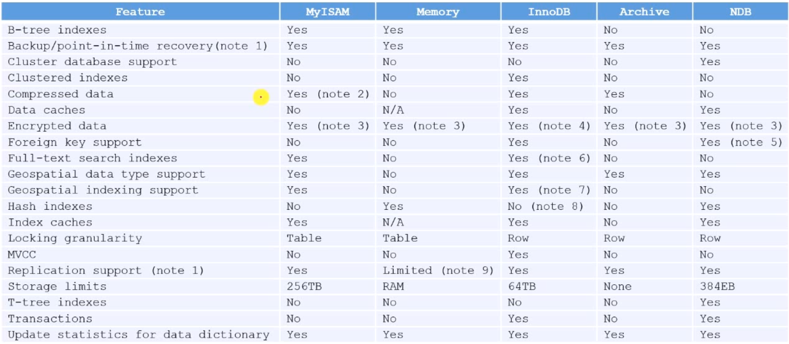

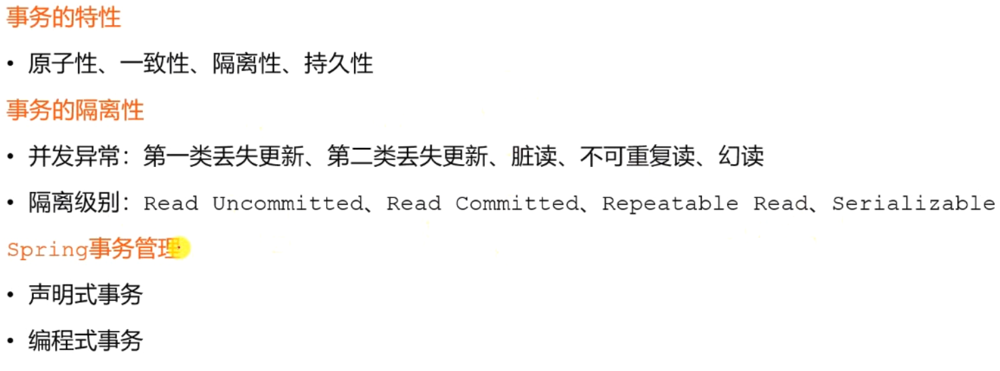

### 隔离性

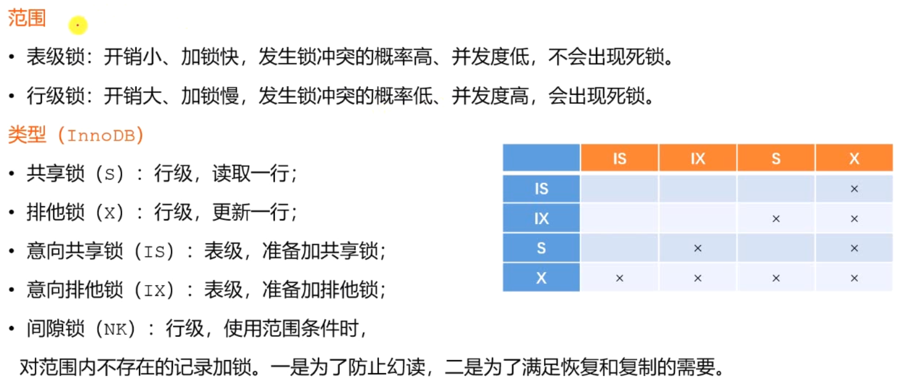

先加IS然后S, 先加IX然后X。

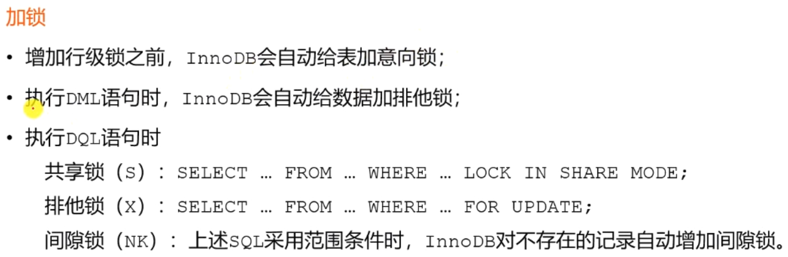

查询语句默认不加锁

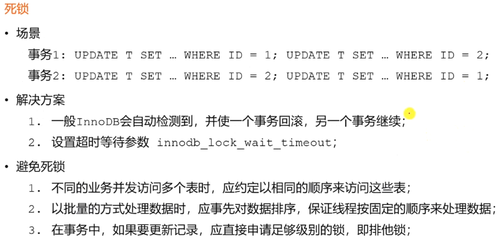

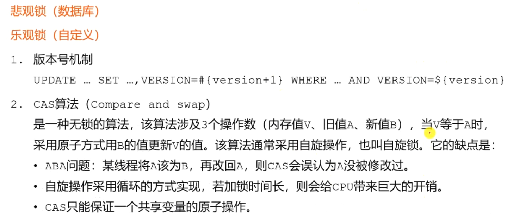

悲观锁是数据库默认的，自己实现锁就是自定义。 实现机制两种。法1比较麻烦，没一张表都要带上。法2CAS, 

索引是为了提高查询的效率： 

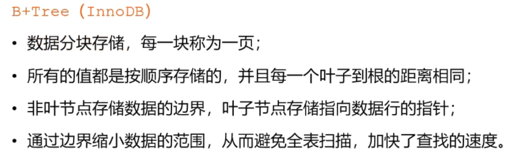

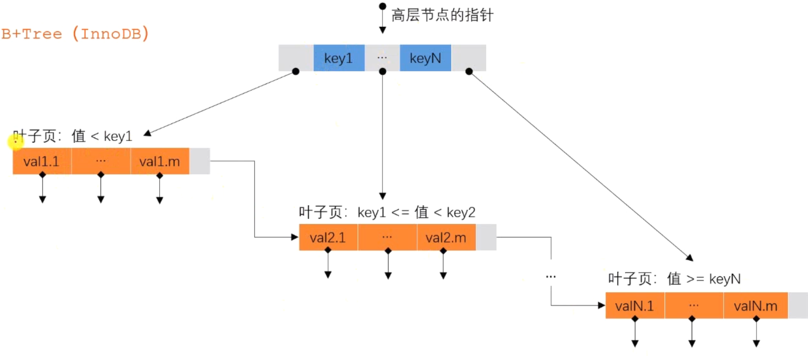

## 2.Redis

数据类型、过期策略、淘汰策略、缓存穿透、缓q存击穿、缓存雪崩、分布式锁

### 数据类型

### 过期策略

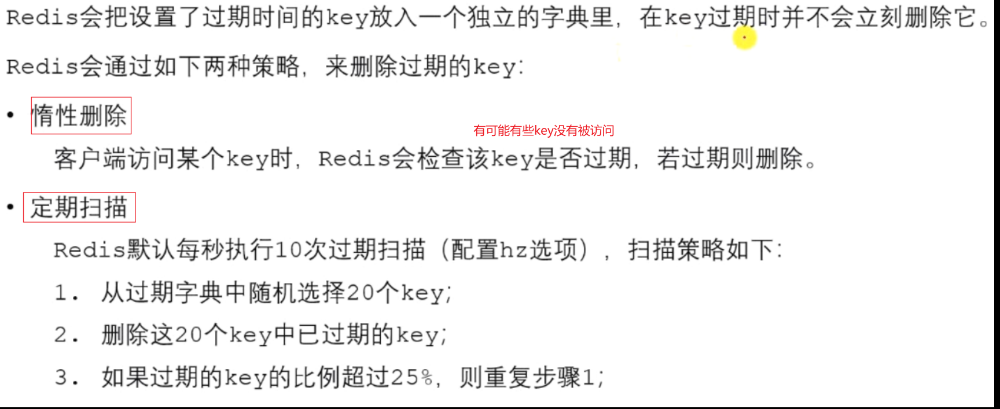

### 淘汰策略

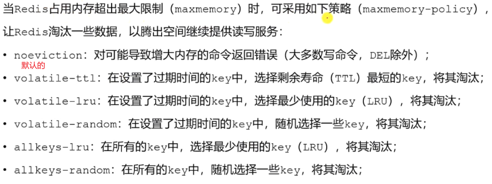

### LRU算法

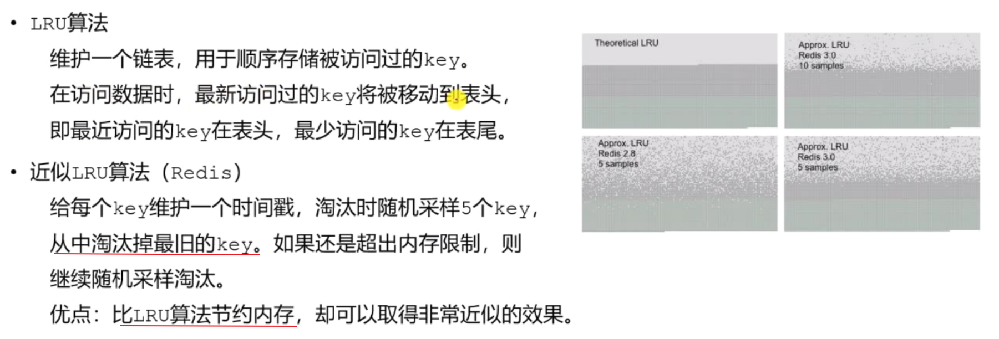

### 缓存穿透

缓存失效，导致数据库瘫痪

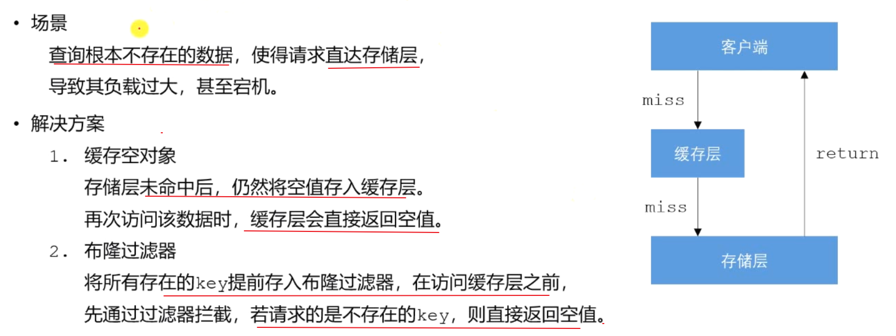

### 缓存击穿

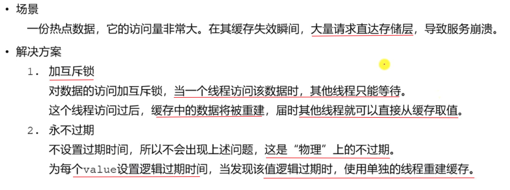

### 缓存雪崩

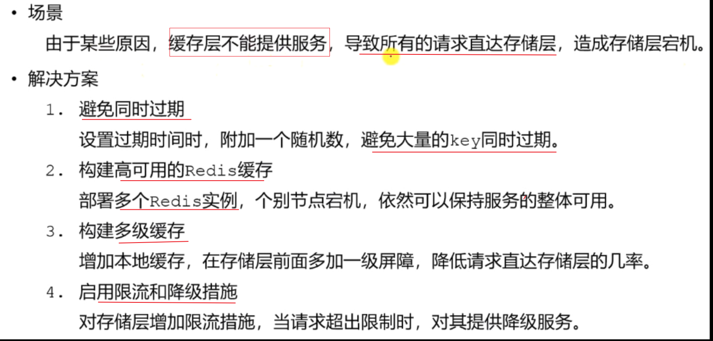

### 分布式锁

肯定会问

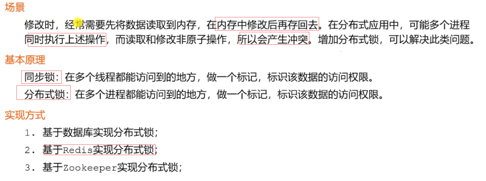

### 单Redis实例实现分布式锁

## 3. Spring

Spring IoC、Spring AOP、Spring MVC
范围：
（1）表级锁：开销小、加锁快，发生锁冲突的概率高、并发度低，不会出现死锁。
（2）行级锁：开销大、加锁慢，发送锁冲突的概率低、并发度高，会出现死锁。
类型
（1）共享锁（S）：行级，读取一行；
（2）排他锁（X）：行级，更新一行；
（3）意向共享锁（IS）：表级，准备加共享锁；
（4）意向排他锁（IX）：表级，准备加排他锁；
（5）间隙锁（NK）：行级，使用范围条件时，
对范围内不存在的记录加锁。一是为了防止幻读，二是为了满足复制和恢复的需要。

  加锁
增加行级锁之前，InnoDB会自动给表加意向锁。
执行DML语句时，InnoDB会自动给数据加排他锁；
执行DQL语句时

  死锁
场景
（1）事务1：UPDATE T SET … WHERE ID = 1;UPDATE T SET … WHERE ID = 2;
（1）事务2：UPDATE T SET … WHERE ID = 2;UPDATE T SET … WHERE ID = 1;
解决方案
（1）一般InnoDB会自动检测到，并使一个事务回滚，另一个事务继续；
（2）设置超时等待参数innodb_lock_wait_timeout;

  悲观锁（数据库）；乐观锁（自定义）

  B+Tree(InnoDB)
（1）数据分块存储，每一块称为一页；
（2）所有的值都是按顺序存储 的，并且每一个叶子到根的距离相同；
（3）非叶子节点存储数据的边界，叶子节点存储指向数据行的指针；
（4）通过边界缩小数据的范围，从而避免全表扫描，加快了查找的速度。

  Redis的数据类型

  redis的过期策略

  redis淘汰策略

其中LRU算法

  缓存失效的问题

  缓存击穿

  缓存雪崩

  分布式锁

  Redis实现分布式锁的原则

  单Redis实例实现分布式锁

  多Redis实例实现分布式锁

  Bean的作用域（IoC相关）

  AOP的术语

  Spring MVC（HandlerAdapter里边调了Controller）

————————————————
版权声明：本文为CSDN博主「xiaoshuzi666」的原创文章，遵循CC 4.0 BY-SA版权协议，转载请附上原文出处链接及本声明。
原文链接：https://blog.csdn.net/xiaoshuzi666/article/details/108230430